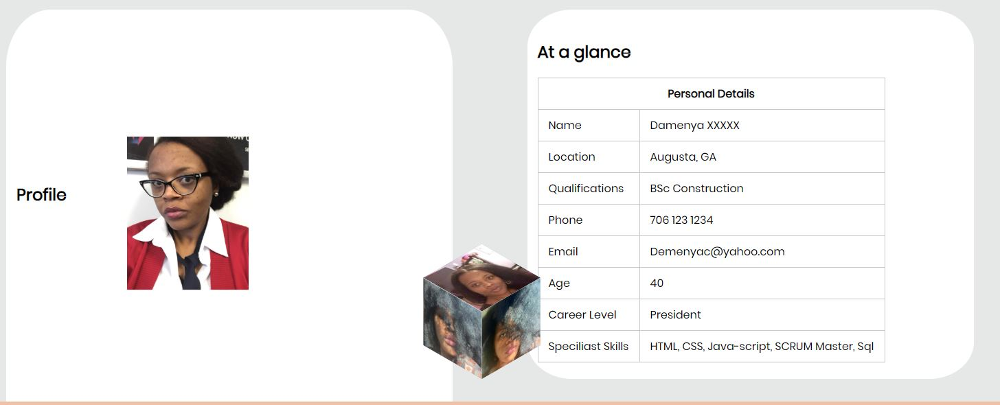

# **Clubhouse Codeschool Project Week Two**
1. :+1: :octocat: *My second webpage ever built in HTML and CSS :tada:
2. The task is to build a web-page with some advanced html & css concepts. I wanted to link 3 html pages to one web-page. I inserted color changes to the links with a hover.
3. I used css transforms to build a 2D cube demo on the demiabout.html with 3 jpgs and had to use overflow.hidden to make the pictures work and also ensure width was set to 100%. Insanely proud when the hover actually worked! :sparkles: 
4. Back-ground transitions on hover from light to dark.
5. Absolute support on my personal creed.\
As Theodore Roosevelt said:
>It is not the critic who counts; 
>not the man who points out how the strong man stumbles, 
>or where the doer of deeds could have done them better. 
>The credit belongs to the man who is actually in the arena, 
>whose face is marred by dust and sweat and blood; 
>who strives valiantly; who errs, 
>who comes short again and again, 
>because there is no effort without error and shortcoming;
>but who does actually strive to do the deeds; 
>who knows great enthusiasms, 
>the great devotions; who spends himself in a worthy cause; 
>who at the best knows in the end the triumph of high achievement, 
>and who at the worst, if he fails, 
>at least fails while daring greatly,
>so that his place shall never be with those cold and timid souls who neither know victory nor defeat.
# [Website](https://diamondgal.github.io/Demiwebpage/)

